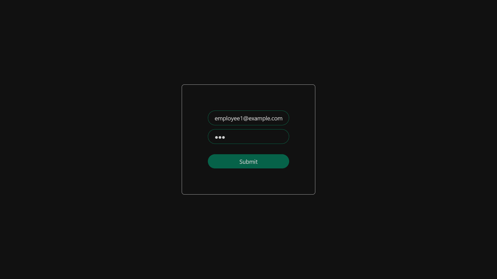
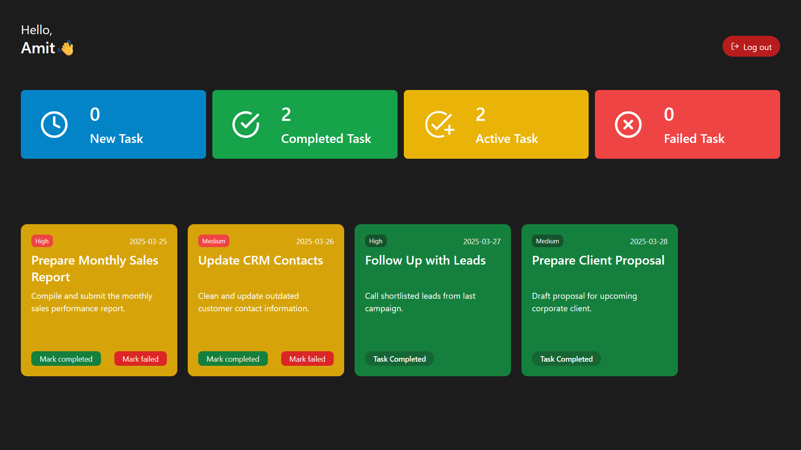
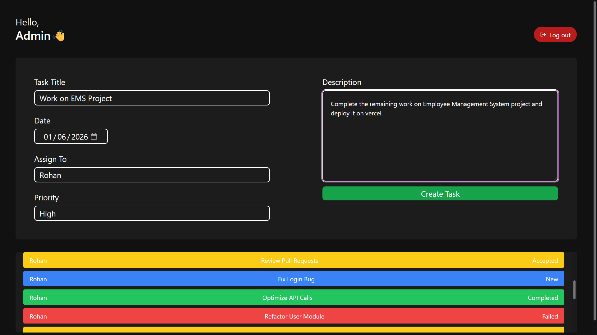

# WorkTrack – Role-Based Task Tracking & Workflow Management System

WorkTrack is a role-based task tracking system built using **React** that works entirely on **Local Storage**.
Admins can assign tasks to employees, and employees can accept, complete, or fail tasks.
All task updates are reflected instantly across dashboards.

---

## 🌐 Live Demo

👉 **[https://worktrack.vercel.app](https://worktrack.vercel.app)**

---

## ✨ Features

* Role-based authentication (Admin / Employee)
* Admin can create and assign tasks
* Employees can:

  * Accept new tasks
  * Mark tasks as completed or failed
* Task counters auto-update across dashboards
* Persistent data using browser Local Storage
* Fully responsive UI

---

## 📸 Demo Flow

### Step 1 – Login Page



---

### Step 2 – Employee Dashboard



---

### Step 3 – Admin Login


---

### Step 4 – Admin Dashboard (Create & View Tasks)



---

### Step 5 – Employee Dashboard After Task Assignment


---

## 🔐 Demo Credentials

### Admin

* Email: `admin@example.com`
* Password: `123`

### Employees

| Name  | Email                                                 | Password |
| ----- | ----------------------------------------------------- | -------- |
| Amit  | [employee1@example.com](mailto:employee1@example.com) | 123      |
| Rohan | [employee2@example.com](mailto:employee2@example.com) | 123      |
| Priya | [employee3@example.com](mailto:employee3@example.com) | 123      |

---

## 🛠 Tech Stack

* React
* Context API
* Tailwind CSS
* Local Storage (No backend)

---

## 🚀 Run Locally

```bash
npm install
npm run dev
```

Open in browser:

```
http://localhost:5173
```
